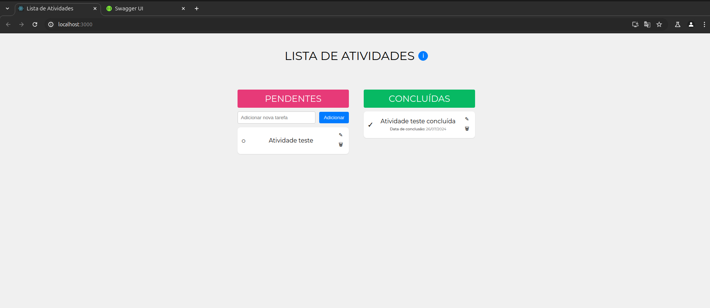

# Lista de Atividades

Essa é uma aplicação para gerenciamento de atividades que é possível adicionar, editar, excluir e organizar as atividades entre <b>PENDENTES</b> ou <b>CONCLUÍDAS</b>.

## 1. Funcionalidades
- Adicionar atividades: Crie novas atividades na coluna <b>PENDENTES</b>.
- Editar atividades: Modifique a descrição de uma atividade existente.
- Excluir atividades: Remova atividades da lista.
- Marcar como Concluída: Mova atividades para a coluna <b>CONCLUÍDAS</b>.
- Organização por Arrastar e Soltar: Arraste atividades para reorganizá-las nas colunas.

## 2. Tecnologias Utilizadas
- <b>Frontend:</b> React, CSS
- <b>Backend</b>: Node.js, Express, Sequelize
- <b>Banco de Dados</b>: Postgres

## 3. Instalação
### 3.1 Requisitos
- Docker versão 27.0.3 ou mais
- cocker-compose versão 2.28.1 ou mais

### 3.2 Passos para Instalação
1. Clone o repositório.

```
git clone https://github.com/julianavalle/lista_de_atividades.git
```

2. Abra o repositório no terminal de sua preferência.

```
cd lista_de_atividades
```

3. Na pasta do repositório, build os contêineres Docker.
```
docker-compose up --build -d
```

4. Após o build, suba os contêineres.
```
docker-compose up
```

5. Acesse a aplicação no link:
```http://localhost:3000```



6. Para visualizar a documentação do backend acesse: ```http://localhost:8000/api-docs```


## 4. Uso
1. Adicionar Atividades: Na coluna <b>PENDENTES</b>, digite uma descrição na caixa de texto e clique no botão <b>Adicionar</b> para criar uma nova atividade.

2. Editar Atividades: Clique no ícone de lápis ao lado da atividade para editar sua descrição.

3. Excluir Atividades: Clique no ícone de lixeira para remover a atividade.

4. Marcar como Concluída: Clique no ícone de círculo ao lado da descrição da atividade para marcá-la como concluída. A atividade será movida para a coluna <b>CONCLUÍDAS</b>.

5. Arraste as Atividades: Arraste a atividade para concluir ou voltar para pendente.